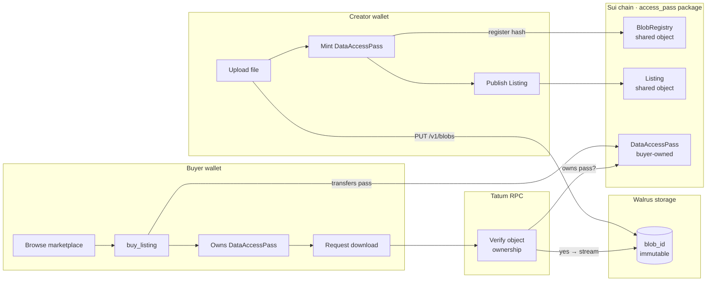

# BlobPass

**A decentralized, zero-trust marketplace for files — stored on Walrus, gated by native Sui access passes, verified through Tatum RPC.**

Built for the **Tatum × Sui with Walrus Hackathon**.

---

## What is BlobPass?

BlobPass lets creators sell digital files — datasets, PDFs, 3D models, ZIPs, anything — without trusting a platform with the file itself or the money. The file lives immutably on Walrus. The right to download it is a Sui object (a `DataAccessPass`) that the buyer's wallet holds forever. There is no platform server in the middle: settlement is direct wallet-to-wallet on Sui, and every download is gated by an on-chain ownership check served by Tatum RPC.

The system is built around a **custom Move asset ledger and shared registry** — `blobpass::access_pass` — instead of generic kiosk or NFT containers. That makes the on-chain side cheap, fast, and purpose-built for storage: blobs are deduplicated by content hash in a shared `BlobRegistry`, passes are minted as lightweight individual objects, and verification is a single object-ownership read.

---

## Why it matters

Most "decentralized" content platforms still custody the file, the listing, and the proceeds — they're decentralized in name only. BlobPass decouples the three layers so no single party has to be trusted:

| Concern | Centralized platforms | BlobPass |
|---|---|---|
| Where the file lives | Their S3 bucket | Walrus (immutable, content-addressed) |
| Who proves you own access | Their database row | A Sui object in your wallet |
| Who holds the money during a sale | Their treasury | Nobody — settlement is atomic on-chain |
| Who decides if a listing stays up | Their moderators | The seller (delist anytime) |
| What happens if they shut down | You lose everything | Your pass + blob still exist |

---

## How it works at a glance



---

## Architecture

BlobPass is a three-layer system. Each layer is independently verifiable and replaceable.

### 1. Storage layer — Walrus

Files are streamed straight from the browser to a Walrus **publisher** node. Walrus returns a content-addressed `blob_id`. The file is never persisted on a BlobPass server.

For reads, every preview image and download is routed through `/api/walrus/[blobId]` — a same-origin proxy that:
- Tries any configured Walrus **aggregator** (`WALRUS_AGGREGATOR_URL`), with hard-coded fallbacks to `aggregator.walrus-testnet.walrus.space` and `walrus-testnet-aggregator.stakely.io` for resilience
- Serves with `Cache-Control: public, max-age=31536000, immutable` so optimized images are cached at the edge
- Lets `next/image` resize previews to AVIF/WebP without per-host `remotePatterns` juggling

### 2. Commerce & rights layer — custom Move ledger

The on-chain side is the `blobpass::access_pass` Move package. It defines three object types and one shared registry:

| Object | Owner | Purpose |
|---|---|---|
| `BlobRegistry` | shared | Dedup table keyed by file hash. Prevents the same blob being re-paid storage twice. |
| `Listing` | shared | A live offer — wraps a pass, exposes a price, anyone can call `buy_listing` against it. |
| `DataAccessPass` | individual wallet | The proof of access. Carries `blob_id`, file hash, royalty terms, storage window. |
| `AccessPointer` | individual wallet | Lightweight "I bought a copy" pass for duplicate-content reuses — points at the same blob without re-paying storage. |

**Public entry points** (`move/blobpass/sources/access_pass.move`):

| Function | Caller | Effect |
|---|---|---|
| `create_listing` | seller | Mint a fresh pass + publish a listing. |
| `create_registered_listing` | seller | Same, but also registers the file hash in `BlobRegistry` so dupes can reuse storage. |
| `mint_access_pointer` | buyer | When a file hash already exists in the registry, mint a cheaper pointer pass instead of re-uploading. |
| `extend_registered_storage` | anyone | Top up a blob's storage window before it expires. |
| `buy_listing` | buyer | Pay the seller (atomic SUI transfer) and receive the `DataAccessPass`. |
| `delist_listing` | seller | Pull a listing and return the pass to the seller. |
| `list_owned_pass` | pass holder | Re-list a pass you already hold (bought or self-issued). |

No kiosk container. No third-party marketplace contract. Every action is a direct entry call against BlobPass-owned objects, so gas costs and verification paths stay tight.

### 3. Verification layer — Tatum RPC

When a buyer requests a download, the app reads the Sui chain through a Tatum RPC node. It checks two things:
1. Does the connecting wallet currently own the `DataAccessPass` that maps to this `blob_id`?
2. Is the `BlobRegistry` entry for the file still inside its storage window?

If both pass, the app streams the blob from Walrus through the same-origin proxy. If either fails, no bytes leave the aggregator. Tatum was chosen for read-side latency — index pages and ownership checks fan out to it in parallel.

### Off-chain indexer

`src/lib/blobpass/chain-index.ts` paginates `ListingCreated` / `ListingPurchased` / `ListingDelisted` events from Sui and projects them into a normalized in-memory ledger. Marketplace and library pages read from this projection, not directly from the chain, so first paint is fast and resilient to RPC hiccups (timeouts are bounded with `AbortSignal.timeout(4_000)`).

---

## Tech stack

- **Frontend:** Next.js 15 (App Router) · React · TypeScript · Tailwind CSS v4
- **3D hero:** Three.js (vanilla, no react-three-fiber — direct mount for tight control)
- **Wallet & chain:** `@mysten/dapp-kit`, `@mysten/sui`
- **State / data:** TanStack Query
- **Storage:** Walrus Protocol (publisher PUT / aggregator GET via same-origin proxy)
- **Chain RPC:** Tatum Sui RPC
- **Smart contracts:** Sui Move — custom `blobpass::access_pass` package

---

## Repo layout

```
move/blobpass/
  sources/access_pass.move      ← the custom Move ledger

src/
  app/
    page.tsx                    ← landing
    marketplace/                ← live listings
    library/                    ← assets owned by connected wallet
    upload/                     ← creator flow
    api/
      upload/                   ← stream file → Walrus publisher
      walrus/[blobId]/          ← same-origin Walrus aggregator proxy + cache
      marketplace/              ← indexed listings
      library/                  ← per-wallet asset projection
      delist/                   ← post-tx ledger sync
      access-pointer/           ← cheaper re-buys for duplicate hashes
      index-listing/            ← post-tx ledger sync for new listings
      hash-check/               ← "does this file already exist?" gate
      storage-top-up/, download/, purchase/, auth/

  components/
    landing/                    ← hero, terminal, value blocks, 3D rabbit
    marketplace/                ← catalog
    library/                    ← table + grid views
    upload/                     ← multi-section upload form
    chrome.tsx, MobileMenu.tsx  ← header + footer + mobile nav

  lib/blobpass/
    sui.ts                      ← transaction builders for every entry fun
    walrus.ts                   ← publisher upload + aggregator URL helpers
    chain-index.ts              ← event-driven indexer
    ledger.ts, registry.ts      ← projections used by API routes
    types.ts, format.ts, verified.ts
```

---

## Local setup

### Prerequisites
- Node.js ≥ 18
- npm / pnpm / yarn
- A Sui wallet (Sui Wallet, Surf, or any Wallet Standard wallet) connected to **Testnet** with test SUI

### 1. Clone

```bash
git clone https://github.com/your-username/blobpass.git
cd blobpass
```

### 2. Install

```bash
npm install
# or pnpm install / yarn install
```

### 3. Configure env

Create `.env.local` at the repo root:

```bash
# Sui RPC (Tatum or any Sui testnet node)
NEXT_PUBLIC_TATUM_SUI_RPC=https://fullnode.testnet.sui.io:443
TATUM_SUI_RPC_URL=https://fullnode.testnet.sui.io:443
TATUM_API_KEY=                 # optional — only needed for premium Tatum endpoints

# Walrus testnet (publisher = uploads, aggregator = downloads)
NEXT_PUBLIC_WALRUS_PUBLISHER=https://publisher.walrus-testnet.walrus.space
NEXT_PUBLIC_WALRUS_AGGREGATOR=https://walrus-testnet-aggregator.stakely.io
WALRUS_PUBLISHER_URL=https://publisher.walrus-testnet.walrus.space
WALRUS_AGGREGATOR_URL=https://walrus-testnet-aggregator.stakely.io

# Published Move package + shared objects (use the deployed testnet IDs)
NEXT_PUBLIC_BLOBPASS_PACKAGE_ID=0x5aa72d06d1f3b33c833a96ad19bfa2aaac917484bf9bd6475f98814982433549
NEXT_PUBLIC_BLOBPASS_REGISTRY_ID=0x7b8b867f67a566975b4b4062d1fa082c1d42f1ae6ee3239c510de561e1e14a47
NEXT_PUBLIC_BLOBPASS_REGISTRY_INITIAL_SHARED_VERSION=400451868

# Optional: addresses recognized as verified creators
BLOBPASS_VERIFIED_CREATORS=0xyour-address-here
```

> **Production deploy note:** the same four `WALRUS_*` vars **must** be set on the production host (Vercel / Render / etc.). The upload pipeline refuses to fall back to local-disk storage in production — without a configured publisher, uploads throw immediately rather than create a listing whose blob exists only on the build machine.

### 4. Run

```bash
npm run dev
```

Open <http://localhost:3000>.

---

## End-to-end verification

### Creator flow (upload + list)
1. Connect a Sui Testnet wallet from the header.
2. Visit `/upload`.
3. Drop a file. SHA-256 is computed in-browser before anything leaves.
4. Fill metadata, set price in SUI, choose storage epochs, click `[ MINT & LIST ─→ ]`.
5. The browser streams the file to the Walrus publisher → receives a `blob_id`.
6. Wallet prompts you to sign `create_registered_listing` — this mints a `DataAccessPass`, publishes a `Listing`, and registers the file hash in `BlobRegistry`. All in one tx.
7. You'll see the new listing on `/marketplace` and in your `/library`.

### Buyer flow (purchase + download)
1. Switch wallets (or use a second account).
2. Open `/marketplace`, find the listing, click `[ BUY INSTANT ACCESS ]`.
3. Wallet signs `buy_listing` — SUI is transferred to the seller, `DataAccessPass` lands in your wallet.
4. Pass appears under `/library`. Click download.
5. Backend verifies (via Tatum RPC) that your wallet currently holds the pass, then proxies the bytes from Walrus.

### Seller flow (delist / re-list)
- `/library` → your listing → `[ DELIST ]` returns the pass to your wallet.
- A pass already in your wallet (bought or self-issued) → `[ LIST FOR SALE ]` re-publishes it under a new `Listing` (via `list_owned_pass`).

---

## Known limits

- **Testnet only** for this submission. Mainnet deploy is a config flip.
- **Image previews are public.** Encrypted previews are out of scope; the gated content is the underlying blob, not its thumbnail.
- **Duplicate-content shortcut** (`mint_access_pointer`) currently fires when the uploader presents a file whose hash already exists in `BlobRegistry`. It re-uses the storage payment but mints a new pass under the new seller — this is intentional but is a policy choice worth flagging.
- **No off-chain royalty enforcement.** Royalty terms are recorded on the pass but secondary-sale enforcement depends on every marketplace honoring them. BlobPass honors them on its own re-listings.

---

## License

MIT — see `LICENSE` if present, otherwise consider this codebase MIT for the purposes of evaluation.
